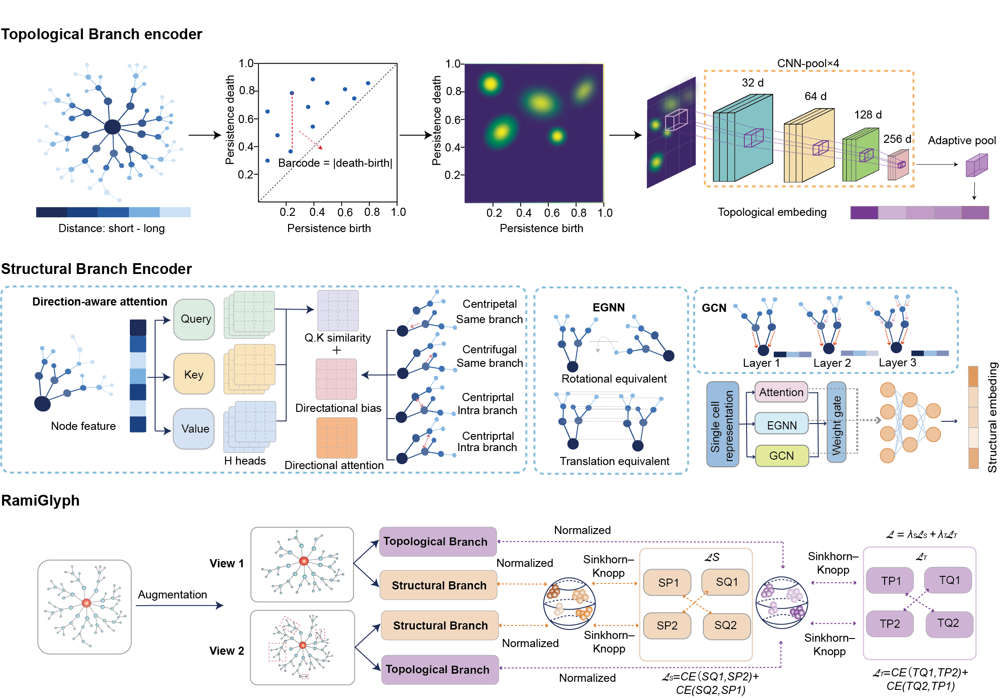

# **RamiGlyph Captures Microglial Morphological Diversity**

RamiGlyph is a self-supervised framework for learning representations of 3D microglial morphology using structural and topological features.

<p align="center">
  
</p>

## Data Preparation

Organize SWC files by split and condition, then set the dataset path in `config.json`.

```text
MyDataset/
├── train/
│   ├── Control/
│   └── Treatment/
└── val/
    ├── Control/
    └── Treatment/
```

To prepare the dataset:

```bash
python dataloader/prepare_dataset.py /path/to/dataset
```

## Installation

Python 3.9+ is recommended.

```bash
pip install -r requirements.txt
```

## Training

Set the dataset path in `config.json`, then run:

```bash
python train.py
```

Checkpoints and logs are saved to `checkpoint_dir`.

## Evaluation

Evaluate the learned representations using KNN and bootstrap analysis:

```bash
python evaluation/knn.py
python evaluation/bootstrap.py
```

## Morphology Complexity Score

Project SWC morphologies onto the RamiGlyph reference trajectory to obtain a morphology complexity score (0 = simple, 1 = complex).

```bash
python morphology_score/morthology_score.py
```
## Example Data

A small example SWC dataset from the Sigert Lab is provided in `example_data` for testing the pipeline and verifying the installation.
